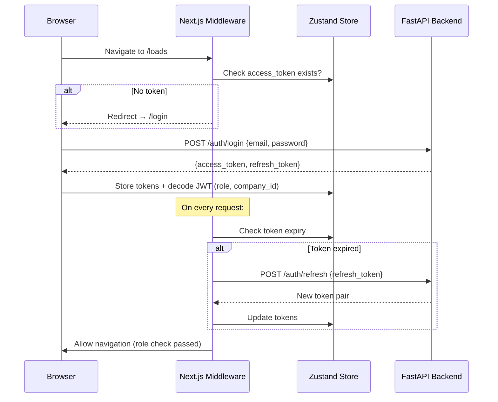

# Safehaul TMS — Frontend Architecture & Build Plan

## Executive Summary

This document defines the complete frontend architecture, UI/UX strategy, and phased execution roadmap for the Safehaul TMS platform — a multi-tenant B2B SaaS designed for trucking companies. Every design decision maps directly to the FastAPI backend models (`Load`, `Trip`, `LoadStop`, `Driver`, `DriverSettlement`, etc.) and the API surface analyzed in the prior codebase audit.

---

## 1. Recommended Tech Stack & Architecture

### 1.1 Framework: Next.js 14+ (App Router)

**Why Next.js over plain React or Vue:**

| Criterion | Decision Rationale |
|-----------|-------------------|
| **SSR/SSG** | The executive dashboard KPIs (`GET /dashboard/kpis`) benefit from server-side rendering for instant first paint. Settlement PDFs and compliance reports can be pre-rendered. |
| **File-based routing** | Maps cleanly to the domain structure: `/loads`, `/fleet/trucks`, `/fleet/trailers`, `/drivers`, `/accounting/settlements` — mirrors the API prefix hierarchy exactly. |
| **Middleware** | Next.js middleware handles JWT refresh logic and role-based route guards (`UserRole` enum: `super_admin`, `company_admin`, `dispatcher`, `accountant`) before the page even loads. |
| **API route proxying** | Avoids CORS headaches entirely — the backend's `allow_origins=["*"]` is a known gap; Next.js API routes can proxy authenticated requests. |
| **React ecosystem** | Full access to the React component library ecosystem (shadcn/ui, Recharts, react-hook-form) — critical for the data-dense tables and forms this TMS requires. |

### 1.2 Core Library Stack

```
┌─────────────────────────────────────────────────────────────┐
│                     NEXT.JS 14 (App Router)                 │
├─────────────────────────────────────────────────────────────┤
│  Data Fetching    │  TanStack Query v5 (React Query)        │
│  State Mgmt       │  Zustand (lightweight global state)     │
│  Forms            │  React Hook Form + Zod validation       │
│  UI Components    │  shadcn/ui + Radix Primitives           │
│  Styling          │  Tailwind CSS v3                        │
│  Charts           │  Recharts                               │
│  Tables           │  TanStack Table v8                      │
│  Icons            │  Lucide React                           │
│  Date Handling    │  date-fns                               │
│  PDF Viewer       │  Native <iframe> (backend streams PDF)  │
│  Notifications    │  Sonner (toast library)                 │
│  Theme            │  next-themes (dark/light toggle)        │
└─────────────────────────────────────────────────────────────┘
```

#### Why These Specific Libraries:

**TanStack Query v5** — The backend API uses consistent pagination (`page`, `page_size`, `total` in every `*ListResponse` schema) and filtering patterns. TanStack Query's `useInfiniteQuery` and `keepPreviousData` options handle the load board tabs, settlement lists, and driver tables with built-in caching, background refetching, and optimistic updates. The `LoadListResponse`, `DriverListResponse`, `SettlementListResponse` schemas all return `{ items, total, page, page_size }` — a perfect fit for TanStack Query's pagination pattern.

**React Hook Form + Zod** — Load creation (`LoadCreate` schema) requires nested arrays of `StopCreate` and `AccessorialCreate` objects with dynamic add/remove. React Hook Form's `useFieldArray` handles this natively. Zod mirrors Pydantic's validation model (the `RegisterRequest` password regex, the `StopCreate` required fields) so frontend validation matches backend validation exactly.

**shadcn/ui** — Not a component library you install — it's a collection of copy-paste components built on Radix Primitives. This gives us:
- Full control over styling (critical for matching B2B TMS industry aesthetics)
- Accessible by default (ARIA-compliant)
- Data-dense components: `DataTable`, `Command` (combobox for broker auto-complete), `Sheet` (for the LoadDrawer sidebar pattern), `Dialog`, `Tabs`
- Dark mode via CSS variables + `next-themes`

**TanStack Table v8** — The load board, driver roster, fleet list, and settlement list are all paginated data tables with sorting, filtering, and inline actions. TanStack Table is headless — pairs perfectly with shadcn/ui's `DataTable` component.

### 1.3 Project Structure

```
frontend/
├── app/                           # Next.js App Router
│   ├── (auth)/                    # Auth layout group (no sidebar)
│   │   ├── login/page.tsx
│   │   └── register/page.tsx
│   ├── (dashboard)/               # Dashboard layout group (with sidebar)
│   │   ├── layout.tsx             # Sidebar + TopBar shell
│   │   ├── page.tsx               # Executive Dashboard (home)
│   │   ├── loads/
│   │   │   ├── page.tsx           # Load Board (tabs: Live/Upcoming/Completed)
│   │   │   ├── new/page.tsx       # Create Load wizard
│   │   │   └── [id]/page.tsx      # Load detail (full page)
│   │   ├── dispatch/
│   │   │   └── page.tsx           # Dispatch command center
│   │   ├── fleet/
│   │   │   ├── trucks/page.tsx
│   │   │   └── trailers/page.tsx
│   │   ├── drivers/
│   │   │   ├── page.tsx           # Driver roster
│   │   │   └── [id]/page.tsx      # Driver profile + compliance
│   │   ├── accounting/
│   │   │   ├── settlements/page.tsx
│   │   │   └── invoices/page.tsx
│   │   └── settings/
│   │       └── page.tsx           # Company profile, users, defaults
│   ├── admin/                     # Super Admin portal
│   │   ├── layout.tsx
│   │   ├── page.tsx               # Tenant overview
│   │   └── companies/page.tsx
│   ├── globals.css
│   └── layout.tsx                 # Root layout
├── components/
│   ├── ui/                        # shadcn/ui primitives
│   ├── layout/
│   │   ├── Sidebar.tsx
│   │   ├── TopBar.tsx
│   │   └── MobileNav.tsx
│   ├── loads/
│   │   ├── LoadBoard.tsx          # Tabbed data table
│   │   ├── LoadDrawer.tsx         # Side panel preview
│   │   ├── LoadForm.tsx           # Create/edit form
│   │   ├── StatusBadge.tsx        # 8-stage color-coded badge
│   │   └── StatusStepper.tsx      # Visual pipeline stepper
│   ├── dispatch/
│   │   ├── DispatchPanel.tsx      # Driver/truck selection
│   │   └── ComplianceCard.tsx     # Inline compliance check
│   ├── drivers/
│   │   ├── DriverTable.tsx
│   │   └── ComplianceAlert.tsx
│   ├── fleet/
│   │   ├── TruckTable.tsx
│   │   └── TrailerTable.tsx
│   ├── accounting/
│   │   ├── SettlementTable.tsx
│   │   └── SettlementDetail.tsx
│   └── dashboard/
│       ├── KPICards.tsx
│       ├── FleetDonut.tsx
│       ├── ComplianceAlertList.tsx
│       └── RecentEvents.tsx
├── lib/
│   ├── api.ts                     # Axios/fetch client + interceptors
│   ├── auth.ts                    # Token management + refresh logic
│   ├── hooks/                     # Custom hooks per domain
│   │   ├── useLoads.ts            # TanStack Query hooks for /loads/*
│   │   ├── useDrivers.ts
│   │   ├── useFleet.ts
│   │   ├── useDashboard.ts
│   │   └── useAccounting.ts
│   ├── stores/
│   │   ├── authStore.ts           # Zustand: user, tokens, company
│   │   └── uiStore.ts            # Zustand: sidebar state, theme
│   ├── schemas/                   # Zod schemas (mirror Pydantic)
│   │   ├── load.ts
│   │   ├── driver.ts
│   │   └── auth.ts
│   └── utils/
│       ├── formatters.ts          # Currency, dates, miles
│       └── constants.ts           # Status colors, role labels
├── public/
│   └── logo.svg
├── middleware.ts                   # Auth guard + role routing
├── next.config.mjs
├── tailwind.config.ts
├── tsconfig.json
└── package.json
```

### 1.4 Authentication Flow



**Token storage strategy:** `localStorage` for refresh token, in-memory (Zustand) for access token. The middleware intercepts all `(dashboard)` routes and verifies role-based access before rendering.

**Role-based route guards** (mapped from `UserRole` enum):

| Route Pattern | `super_admin` | `company_admin` | `dispatcher` | `accountant` |
|--------------|:---:|:---:|:---:|:---:|
| `/admin/*` | ✅ | ❌ | ❌ | ❌ |
| `/` (dashboard) | ✅ | ✅ | ✅ | ✅ |
| `/loads/*` | ✅ | ✅ | ✅ | 👁️ read-only |
| `/dispatch/*` | ✅ | ✅ | ✅ | ❌ |
| `/drivers/*` | ✅ | ✅ | ✅ | 👁️ read-only |
| `/fleet/*` | ✅ | ✅ | ✅ | 👁️ read-only |
| `/accounting/*` | ✅ | ✅ | ❌ | ✅ |
| `/settings/*` | ✅ | ✅ | ❌ | ❌ |

---

## 2. UI/UX Design System — Industry-Grade TMS

### 2.1 Design Tokens & Visual Language

The design system must feel like a **premium operations command center** — not a consumer app. Think McLeod Software, Samsara, KeepTruckin' (Motive).

#### Color Palette

```css
/* CSS Variables — supports dark/light via next-themes */
:root {
  /* Primary: Deep navy → Teal accent (trust + operational clarity) */
  --primary:        220 70% 18%;     /* #0f1a2e — sidebar, headers */
  --primary-accent: 180 65% 45%;     /* #28B5A1 — CTAs, active states */
  
  /* Status Colors — mapped EXACTLY to LoadStatus enum */
  --status-offer:      210 15% 65%;  /* Slate gray */
  --status-booked:     220 80% 60%;  /* Blue */
  --status-assigned:   260 55% 55%;  /* Purple */
  --status-dispatched: 35 90% 55%;   /* Amber */
  --status-in-transit: 25 95% 55%;   /* Orange */
  --status-delivered:  145 60% 45%;  /* Green */
  --status-invoiced:   190 70% 50%;  /* Cyan */
  --status-paid:       145 70% 35%;  /* Deep green */
  --status-cancelled:  0 65% 50%;    /* Red */
  
  /* Compliance Urgency — mapped to 3-tier system */
  --compliance-good:     145 60% 45%;
  --compliance-warning:  45 95% 55%;
  --compliance-critical: 0 75% 55%;
  
  /* Equipment Status */
  --equip-available:   145 55% 45%;
  --equip-in-use:      35 90% 55%;
  --equip-maintenance: 0 65% 50%;
  
  /* Surfaces */
  --background: 220 15% 97%;
  --card:       0 0% 100%;
  --sidebar:    220 70% 8%;
  --border:     220 10% 90%;
}

.dark {
  --background: 220 25% 7%;
  --card:       220 20% 10%;
  --sidebar:    220 30% 5%;
  --border:     220 15% 18%;
}
```

#### Typography
```
Font: Inter (Google Fonts) — optimized for data-dense UI
Hierarchy:
  H1: 24px/600  — Page titles ("Load Board", "Fleet Management")
  H2: 18px/600  — Section headers ("Live Loads", "KPI Summary")
  H3: 14px/600  — Card titles, table headers
  Body: 14px/400 — Default text
  Small: 12px/400 — Timestamps, secondary info
  Mono: 13px JetBrains Mono — Load numbers (LD-00001), settlement numbers (TMS-49202)
```

### 2.2 Global Layout & Navigation

```
┌──────────────────────────────────────────────────────────────┐
│ TopBar                                                       │
│ ┌─────┐  Safehaul TMS    [🔍 Search]    [🌙] [🔔 3] [👤 JW]│
│ └─────┘                                                      │
├────────┬─────────────────────────────────────────────────────┤
│        │                                                     │
│  Side  │              Page Content                           │
│  bar   │                                                     │
│        │  (Routes rendered here)                             │
│  ───── │                                                     │
│  📊 Dashboard                                                │
│  📦 Loads                                                    │
│  🚀 Dispatch                                                 │
│  ───── │                                                     │
│  👤 Drivers                                                  │
│  🚛 Fleet                                                    │
│  ───── │                                                     │
│  💰 Accounting                                               │
│  ───── │                                                     │
│  ⚙️ Settings                                                 │
│        │                                                     │
│  ───── │                                                     │
│  v0.1.0│                                                     │
└────────┴─────────────────────────────────────────────────────┘
```

**Role-Adaptive Sidebar:**

The sidebar items visibility is determined by `UserRole`:

| Sidebar Item | Dispatcher | Accountant | Company Admin |
|-------------|:---:|:---:|:---:|
| Dashboard | ✅ | ✅ | ✅ |
| Loads | ✅ | 👁️ | ✅ |
| Dispatch | ✅ | ❌ | ✅ |
| Drivers | ✅ | 👁️ | ✅ |
| Fleet | ✅ | 👁️ | ✅ |
| Accounting | ❌ | ✅ | ✅ |
| Settings | ❌ | ❌ | ✅ |

**TopBar Components:**
- **Company badge**: Shows `Company.name` from JWT / `/auth/me` response (`UserResponse.company_name`)
- **Global search**: Fuzzy search across loads (by `load_number`, `shipment_id`), drivers, brokers
- **Notification bell**: Badge count from `GET /dashboard/compliance-alerts` → `critical_count`
- **Theme toggle**: Dark/light via `next-themes`
- **User menu**: Profile, role label, logout (`POST /auth/logout`)

### 2.3 The Load Board — Primary Operations View

This is the **most critical screen** — dispatchers live here. The design must support *at-a-glance operational awareness*.

#### Layout: Tabbed Data Table with Quick-Action Drawer

```
┌─────────────────────────────────────────────────────────────┐
│  Load Board                              [+ New Load]       │
│                                                             │
│  ┌──────────┐ ┌──────────┐ ┌──────────┐                    │
│  │ Live (5) │ │Upcoming 3│ │Completed │   [Filter ▾] [🔍]  │
│  └──────────┘ └──────────┘ └──────────┘                    │
│                                                             │
│  ┌──────┬──────┬──────┬──────┬──────┬──────┬──────┬──────┐ │
│  │ Load#│Status│Pickup│Deliv.│Broker│Driver│ Rate │ ⋯    │ │
│  ├──────┼──────┼──────┼──────┼──────┼──────┼──────┼──────┤ │
│  │LD-01 │🟠 IT │Dallas│Denver│CH Rob│R.Will│$3,450│ > □  │ │
│  │LD-02 │🟡 DS │Louis.│Moon T│TQL   │M.Bro │$2,950│ > □  │ │
│  │LD-03 │🟢 DL │Mech. │Moore.│Echo  │C.Gar │$1,950│ > □  │ │
│  └──────┴──────┴──────┴──────┴──────┴──────┴──────┴──────┘ │
│                                                             │
│  Showing 1-3 of 3 loads         [◀ 1 ▶]                   │
└─────────────────────────────────────────────────────────────┘
```

**Tab → API Mapping:**

| Tab | API Endpoint | `LoadStatus` values shown |
|-----|-------------|--------------------------|
| **Live** | `GET /loads/live` | `assigned`, `dispatched`, `in_transit` |
| **Upcoming** | `GET /loads/upcoming` | `offer`, `booked` |
| **Completed** | `GET /loads/completed` | `delivered`, `invoiced`, `paid` |

**Table Columns** (sourced from `LoadListItem` schema):

| Column | Source Field | Rendering |
|--------|-------------|-----------|
| Load # | `load_number` | Monospace, clickable → opens drawer |
| Status | `status` | `StatusBadge` component with color from design tokens |
| Pickup | `pickup_city` + `pickup_date` | "Dallas, TX · Mar 25" |
| Delivery | `delivery_city` + `delivery_date` | "Denver, CO · Mar 27" |
| Broker | `broker_name` | Truncated with tooltip |
| Driver | `driver_name` | "—" if unassigned (offer/booked) |
| Rate | `total_rate` | `$3,450.00` — right-aligned |
| Actions | — | `>` opens LoadDrawer, `□` bulk select |

**Row click → LoadDrawer** (side panel, `Sheet` component):

The LoadDrawer is a 450px side panel that shows the full `LoadResponse`  without leaving the board. It provides:
- **Status stepper**: Visual 8-stage pipeline showing current position
- **Route summary**: Map of `LoadStop[]` (pickup → delivery)
- **Trip card**: If trips exist, show `TripResponse` (driver, truck, trailer, miles)
- **Quick actions**: Contextual buttons based on current `LoadStatus`:
  - `offer` → [Book Load]
  - `booked` → [Assign / Dispatch]
  - `assigned` → [Dispatch]
  - `dispatched` → [Mark In Transit]
  - `in_transit` → [Mark Delivered]
  - `delivered` → [Create Invoice]
- **Financials summary**: `base_rate`, accessorials breakdown, `total_rate`
- **[View Full Detail →]** link to `/loads/[id]`

### 2.4 Load Status Pipeline — StatusBadge & StatusStepper

**StatusBadge** — inline tag in tables:
```
  ┌─────────────┐
  │ 🟠 In Transit │  ← pill badge with status color + icon
  └─────────────┘
```

**StatusStepper** — horizontal pipeline in LoadDrawer/detail page:
```
  ●───●───●───●───◉───○───○───○
  Off Bkd Asg Dsp  IT  Dlv Inv Paid
              ▲              
         Current status
```

Each dot maps to a `LoadStatus` enum value. Completed stages are filled, current stage is pulsing, future stages are hollow. Clicking a future stage (if transition is valid per `LOAD_TRANSITIONS` dict) triggers `PATCH /loads/{id}/status`.

### 2.5 Load Creation Form

The `POST /loads` endpoint accepts `LoadCreate` which contains nested `StopCreate[]` and `AccessorialCreate[]`. The form must be a **multi-step wizard**:

```
Step 1: Broker & Rate Info
  ├── Broker (combobox → GET /brokers/search?q=...)  → broker_id
  ├── Broker Load ID (text)                          → broker_load_id
  ├── Contact Agent (text)                           → contact_agent
  ├── Base Rate ($)                                  → base_rate
  └── Total Miles                                    → total_miles

Step 2: Route (Stops)
  ├── [+ Add Stop]
  ├── Stop 1: Pickup
  │   ├── Facility Name, Address, City, State, Zip
  │   ├── Scheduled Date + Time
  │   └── Notes (PO#, Seal#)
  ├── Stop 2: Delivery
  │   └── (same fields)
  └── (Drag to reorder → updates stop_sequence)

Step 3: Extras & Review
  ├── Accessorials [+ Add]
  │   ├── Type (select: fuel_surcharge|detention|layover|lumper|stop_off|tarp|other)
  │   ├── Amount ($)
  │   └── Description
  ├── Notes (textarea)                               → notes
  └── Total Rate (auto-calculated: base_rate + Σ accessorials)

  [Create Load] → POST /loads
```

**Zod schema** mirrors `LoadCreate` exactly:
```typescript
const loadCreateSchema = z.object({
  broker_id: z.string().uuid().optional(),
  broker_load_id: z.string().optional(),
  base_rate: z.number().positive(),
  total_miles: z.number().positive(),
  stops: z.array(z.object({
    stop_type: z.enum(["pickup", "delivery"]),
    stop_sequence: z.number().int().positive(),
    facility_name: z.string().optional(),
    city: z.string().optional(),
    state: z.string().optional(),
    // ...
  })).min(2, "At least one pickup and one delivery required"),
  accessorials: z.array(z.object({
    type: z.enum(["fuel_surcharge", "detention", "layover", "lumper", "stop_off", "tarp", "other"]),
    amount: z.number().positive(),
    description: z.string().optional(),
  })),
})
```

### 2.6 Dispatch Workflow — The Command Center

The dispatch page is the **power-user cockpit** where a dispatcher takes a load from `offer`/`booked` all the way to `dispatched` in one smooth flow.

```
┌─────────────────────────────────────────────────────────────┐
│  Dispatch Center                                            │
│                                                             │
│  ┌─── Select Load ──────────────┐ ┌─── Assign Assets ────┐ │
│  │                              │ │                       │ │
│  │  Unassigned Loads (offer/    │ │  Available Drivers    │ │
│  │  booked) — compact table    │ │  GET /drivers/available│ │
│  │                              │ │  ┌──────────────────┐ │ │
│  │  Click to select ►          │ │  │ ● R. Williams     │ │ │
│  │  LD-1004  Fremont→Calabasas │ │  │   CDL: ✅ Valid   │ │ │
│  │  $4,350   2100mi   CH Rob   │ │  │   Status: Avail. │ │ │
│  │                              │ │  │   [Select]       │ │ │
│  │                              │ │  └──────────────────┘ │ │
│  │                              │ │                       │ │
│  │                              │ │  Available Trucks     │ │
│  │                              │ │  GET /fleet/trucks/   │ │
│  │                              │ │      available        │ │
│  │                              │ │  ┌──────────────────┐ │ │
│  │                              │ │  │ TRK-103 Peterbilt│ │ │
│  │                              │ │  │ 579 · 2024       │ │ │
│  │                              │ │  │ DOT: ✅ Valid    │ │ │
│  │                              │ │  └──────────────────┘ │ │
│  │                              │ │                       │ │
│  │                              │ │  Available Trailers   │ │
│  │                              │ │  (similar)            │ │
│  └──────────────────────────────┘ └───────────────────────┘ │
│                                                             │
│  ┌─── Compliance Check ────────────────────────────────────┐│
│  │  🟢 R. Williams — CDL valid until Jun 2027              ││
│  │  🟢 Medical card valid until Dec 2026                   ││
│  │  🟢 TRK-103 — DOT inspection current                   ││
│  │                                                         ││
│  │  ✅ All compliance checks passed                        ││
│  └─────────────────────────────────────────────────────────┘│
│                                                             │
│  [────────────── DISPATCH LOAD ──────────────────]          │
│  POST /loads/{id}/dispatch {driver_id, truck_id, trailer_id}│
└─────────────────────────────────────────────────────────────┘
```

**Data sources for each panel:**

| Panel | API Endpoint | Response Model |
|-------|-------------|---------------|
| Unassigned Loads | `GET /loads/upcoming` | `LoadListResponse` (status=offer,booked) |
| Available Drivers | `GET /drivers/available` | `DriverAvailableResponse[]` |
| Available Trucks | `GET /fleet/trucks/available` | `TruckAvailableResponse[]` |
| Available Trailers | `GET /fleet/trailers/available` | `TrailerAvailableResponse[]` |
| Compliance Check | `GET /drivers/{id}/compliance` | `ComplianceResponse` |
| Dispatch Action | `POST /loads/{id}/dispatch` | `LoadResponse` |

**UX details:**
- Selecting a driver triggers an inline compliance check (`GET /drivers/{id}/compliance`) — the `ComplianceResponse.urgency` field drives the badge color
- If compliance has `critical` violations and `Company.enforce_compliance` is true, the Dispatch button is **disabled** with a red warning
- On successful dispatch, the load disappears from the "Upcoming" tab and appears in "Live" — TanStack Query invalidation handles this automatically
- A success toast shows: "Load LD-1004 dispatched to Robert Williams (TRK-103)"

### 2.7 Executive Dashboard

The home page (`/`) is the command center for Company Admins. It consumes four dashboard endpoints.

```
┌─────────────────────────────────────────────────────────────┐
│  Dashboard — Wenze Trucking                    Good Morning │
│                                                             │
│  ┌──────────┐ ┌──────────┐ ┌──────────┐ ┌──────────┐      │
│  │ $12,050  │ │  $2.34   │ │    3     │ │  71.4%   │      │
│  │ Gross Rev│ │ Avg RPM  │ │Active Lds│ │Fleet Eff.│      │
│  └──────────┘ └──────────┘ └──────────┘ └──────────┘      │
│  GET /dashboard/kpis                                        │
│                                                             │
│  ┌─── Fleet Status ─────────┐ ┌─── Compliance Alerts ────┐ │
│  │                          │ │                           │ │
│  │   🍩 Donut Chart         │ │ 🔴 R. Williams — CDL     │ │
│  │                          │ │    expires in 5 days      │ │
│  │   Loaded: 2  (green)     │ │ 🟡 TRK-104 — DOT        │ │
│  │   Available: 1 (blue)    │ │    expires in 22 days     │ │
│  │   In Shop: 1  (red)     │ │                           │ │
│  │                          │ │ 2 critical · 1 warning    │ │
│  │  GET /dashboard/         │ │ GET /dashboard/           │ │
│  │  fleet-status            │ │ compliance-alerts         │ │
│  └──────────────────────────┘ └───────────────────────────┘ │
│                                                             │
│  ┌─── Recent Activity ─────────────────────────────────────┐│
│  │  🟢 LD-1003 Delivered    Mech. → Moore.   C. Garcia     ││
│  │  🟠 LD-1001 In Transit   Dallas → Denver  R. Williams   ││
│  │  🔵 LD-1004 New Offer    Fremont → Calab. —             ││
│  │                                                         ││
│  │  GET /dashboard/recent-events                           ││
│  └─────────────────────────────────────────────────────────┘│
└─────────────────────────────────────────────────────────────┘
```

**KPI Card specifications** (from `GET /dashboard/kpis` response):

| Card | Field | Format | Trend Logic |
|------|-------|--------|-------------|
| Gross Revenue | `gross_revenue` | `$12,050.00` | Compare vs. prior period (future API enhancement) |
| Avg RPM | `avg_rpm` | `$2.34` | Revenue per mile |
| Active Loads | `active_loads` | Integer | assigned + dispatched + in_transit |
| Fleet Effectiveness | `fleet_effectiveness` | `71.4%` | `on_trip_drivers / active_drivers × 100` |

**Compliance Alerts** (from `GET /dashboard/compliance-alerts`):
- Each alert has `severity` (critical/warning), `entity_type` (driver/truck), `entity_name`, `description`, `expiry_date`
- Criticals pinned to top with red left-border
- Clicking an alert navigates to the entity detail page (`/drivers/{id}` or `/fleet/trucks/{id}`)

### 2.8 Driver Management

```
┌─────────────────────────────────────────────────────────────┐
│  Drivers                                     [+ Add Driver] │
│                                                             │
│  [All] [Available] [On Trip] [Inactive]     [🔍 Search]    │
│                                                             │
│  ┌──────┬──────┬──────┬──────┬──────┬──────┬──────┐        │
│  │ Name │Status│Type  │CDL   │Med   │Pay   │ ⋯    │        │
│  ├──────┼──────┼──────┼──────┼──────┼──────┼──────┤        │
│  │R.Will│🟠 Trip│W-2  │✅ Jun│✅ Dec│$0.65│ Actions│        │
│  │M.Brow│🟢 Avl│1099  │✅ Mar│✅ Sep│85%  │ Actions│        │
│  │C.Garc│🟢 Avl│W-2   │🟡 Nov│🔴 Jun│$0.62│ Actions│        │
│  │J.Thom│⚫ Inac│Lease │✅ Jan│✅ Mar│$1200│ Actions│        │
│  └──────┴──────┴──────┴──────┴──────┴──────┴──────┘        │
└─────────────────────────────────────────────────────────────┘
```

**Compliance indicators inline** — CDL and Medical Card columns show:
- 🟢 if >30 days to expiry
- 🟡 if 8-30 days to expiry  
- 🔴 if ≤7 days or expired

These are derived client-side from `cdl_expiry_date` and `medical_card_expiry_date` fields in `DriverResponse`.

**Pay column** renders based on `pay_rate_type`:
- `cpm` → `$0.65/mi`
- `percentage` → `85%`
- `fixed_per_load` → `$1,200/ld`
- `hourly` → `$25/hr`
- `salary` → `$52,000/yr`

### 2.9 Accounting — Settlements

```
┌─────────────────────────────────────────────────────────────┐
│  Settlements                          [Generate Settlement] │
│                                                             │
│  [All] [Unposted] [Posted] [Paid]           [🔍 Search]   │
│                                                             │
│  ┌──────┬──────┬──────┬──────┬──────┬──────┬──────┐        │
│  │ Set# │Driver│Period│Gross │Net   │Status│Actions│       │
│  ├──────┼──────┼──────┼──────┼──────┼──────┼──────┤        │
│  │TMS-01│R.Will│3/1-15│$2,100│$1,850│📝 Unp│[Post]│        │
│  │TMS-02│M.Brow│3/1-15│$3,400│$3,060│✅ Pst│[Pay] │        │
│  └──────┴──────┴──────┴──────┴──────┴──────┴──────┘        │
└─────────────────────────────────────────────────────────────┘
```

**Settlement drill-down** (`GET /settlements/{id}`) shows:
- Header: `settlement_number`, driver name, period, status badge
- **Line Items table** (from `SettlementLineItem[]`):
  - `load_pay`: Load # + route + miles + earning amount
  - `accessorial`: Type + description + amount
  - `deduction`: Name + negative amount (red)
  - `bonus`: Description + amount (green)
- **Summary**: Gross Pay – Deductions + Bonuses = **Net Pay** (bold, large)
- **Actions**: [Post] → [Undo] → [Mark Paid] — following `SettlementBatchStatus` lifecycle
- **[Download PDF]** → `GET /settlements/{id}/pdf` → browser download

**Generate Settlement modal** (`POST /settlements/generate`):
- Select driver (dropdown from `GET /drivers`)
- Date range picker (`period_start`, `period_end`)
- Preview → Confirm → Creates `DriverSettlement` with line items

---

## 3. Execution Roadmap — Phased Build Plan

### Phase 0: Scaffolding (Day 1)
- [ ] Initialize Next.js 14 project with App Router, TypeScript strict mode
- [ ] Install and configure: Tailwind CSS, shadcn/ui, next-themes, Lucide icons
- [ ] Set up project structure (folders as defined in §1.3)
- [ ] Configure `lib/api.ts` — Axios client with base URL, JWT interceptor, refresh logic
- [ ] Create Zustand stores: `authStore`, `uiStore`
- [ ] Build root layout with dark/light theme support

---

### Phase 1: Auth + Shell (Days 2-3)
- [ ] **Login page** — email/password form → `POST /auth/login` → store tokens
- [ ] **Register page** — company onboarding → `POST /auth/register`
- [ ] **Next.js middleware** — JWT validation, role-based route protection
- [ ] **Dashboard layout** — Sidebar + TopBar shell (role-adaptive menu items)
- [ ] **Auth hooks**: `useAuth()`, auto-refresh interceptor
- [ ] Verify: Login → see sidebar → logout → redirect to login

> **Backend dependency**: `auth/router.py` (login, register, refresh, me, logout)

---

### Phase 2: Dashboard + KPIs (Days 4-5)
- [ ] **KPI Cards** — 4 metric cards from `GET /dashboard/kpis`
- [ ] **Fleet Status donut** — Recharts donut from `GET /dashboard/fleet-status`
- [ ] **Compliance Alerts list** — from `GET /dashboard/compliance-alerts`
- [ ] **Recent Events feed** — from `GET /dashboard/recent-events`
- [ ] Dark mode polish for all dashboard components

> **Backend dependency**: `dashboard/router.py` (kpis, compliance-alerts, fleet-status, recent-events)

---

### Phase 3: Load Board — Core CRUD (Days 6-9)
- [ ] **LoadBoard component** — Tabbed table (Live/Upcoming/Completed)
- [ ] **TanStack Table** with server-side pagination (`page`, `page_size`)
- [ ] **StatusBadge** component — 8 status colors 
- [ ] **LoadDrawer** — side panel with full `LoadResponse` detail
- [ ] **StatusStepper** — horizontal pipeline visualization
- [ ] **Quick-action buttons** in drawer (advance status → `PATCH /loads/{id}/status`)
- [ ] **Load detail page** (`/loads/[id]`) — full page with all trips, stops, accessorials
- [ ] **Load creation wizard** — multi-step form for `POST /loads` with broker auto-complete

> **Backend dependency**: `loads/router.py` (list, get, create, update, delete, status, board tabs), `brokers/router.py` (search)

---

### Phase 4: Dispatch Workflow (Days 10-12)
- [ ] **Dispatch Center page** — split panel layout
- [ ] **Available resources panels** — drivers, trucks, trailers from `/available` endpoints  
- [ ] **Inline compliance check** card from `GET /drivers/{id}/compliance`
- [ ] **Dispatch action** → `POST /loads/{id}/dispatch` with validation
- [ ] **Trip assignment** panel → `PATCH /loads/{id}/trips/{trip_id}/assign`
- [ ] Toast notifications for success/failure

> **Backend dependency**: `loads/router.py` (dispatch, assign trip), `drivers/router.py` (available, compliance), `fleet/router.py` (available trucks/trailers)

---

### Phase 5: Driver & Fleet Management (Days 13-16)
- [ ] **Driver roster table** — paginated, filterable by status/type
- [ ] **Driver CRUD** — create/edit modal (React Hook Form + Zod)
- [ ] **Driver detail page** — profile, compliance card, trip history, pay config
- [ ] **Truck roster table** — CRUD for trucks
- [ ] **Trailer roster table** — CRUD for trailers
- [ ] **Fleet detail pages** — DOT inspection tracking, ownership info

> **Backend dependency**: `drivers/router.py`, `fleet/router.py`

---

### Phase 6: Accounting & Settlements (Days 17-20)
- [ ] **Settlement list table** — filterable by status, driver
- [ ] **Generate Settlement modal** — driver picker + date range → `POST /settlements/generate`
- [ ] **Settlement detail page** — line items table, financial summary
- [ ] **Post/Undo/Pay actions** — status lifecycle buttons
- [ ] **PDF download** — `GET /settlements/{id}/pdf` → browser download
- [ ] **Invoice generation** — `POST /loads/{load_id}/invoice`

> **Backend dependency**: `accounting/router.py`

---

### Phase 7: Settings & Broker Management (Days 21-23)
- [ ] **Broker directory table** — CRUD with auto-complete search
- [ ] **Settings page** — company profile (placeholder for full implementation)
- [ ] **User management** — (stub, pending backend `users/router.py` completion)

> **Backend dependency**: `brokers/router.py`, `settings_mod/router.py` (stub)

---

### Phase 8: Super Admin Portal (Days 24-25)
- [ ] **Admin layout** — separate from tenant dashboard
- [ ] **Company list** — `GET /admin/companies`
- [ ] **Create tenant** — `POST /admin/companies`
- [ ] **Toggle company status** — `PATCH /admin/companies/{id}`
- [ ] **Impersonation** — `POST /admin/impersonate/{id}` → switch context

> **Backend dependency**: `auth/admin_router.py`

---

### Phase 9: Polish & Production (Days 26-30)
- [ ] **Document Vault** — file upload/download UI for loads, drivers, fleet
- [ ] **Responsive design** — mobile-friendly sidebar collapse, touch targets
- [ ] **Loading states** — skeleton loaders for every table/card
- [ ] **Error boundaries** — graceful error handling with retry
- [ ] **Empty states** — illustrated empty states for each module
- [ ] **Performance audit** — bundle analysis, lazy loading, image optimization
- [ ] **Dockerize** — Dockerfile + docker-compose.yml frontend service
- [ ] **Deploy** — Google Cloud Run alongside backend

---

## 4. Key Technical Decisions Summary

| Decision | Choice | Rationale |
|----------|--------|-----------|
| Framework | Next.js 14 (App Router) | SSR for dashboard, middleware for auth, file-based routing mirrors API |
| Data fetching | TanStack Query v5 | Matches paginated `{items, total, page, page_size}` response pattern |
| State management | Zustand | Lightweight — only auth + UI state needs global; server state in TanStack Query |
| Forms | React Hook Form + Zod | `useFieldArray` for nested stops/accessorials; Zod mirrors Pydantic validation |
| UI library | shadcn/ui + Radix | Full styling control for B2B aesthetic; accessible; DataTable, Sheet, Command built-in |
| Tables | TanStack Table v8 | Headless, server-side pagination, sorting, compatible with shadcn/ui |
| Charts | Recharts | Fleet donut, KPI sparklines; compositional, React-native |
| Styling | Tailwind CSS v3 | Utility-first, CSS variable theming for dark/light, rapid iteration |
| Icons | Lucide React | Clean, consistent; tree-shakeable |

> [!IMPORTANT]
> **This plan is designed to reach a functional MVP (Phases 0-4 = auth + dashboard + load board + dispatch) in approximately 12 working days.** The full build through Phase 9 targets 30 working days for a single experienced developer.
