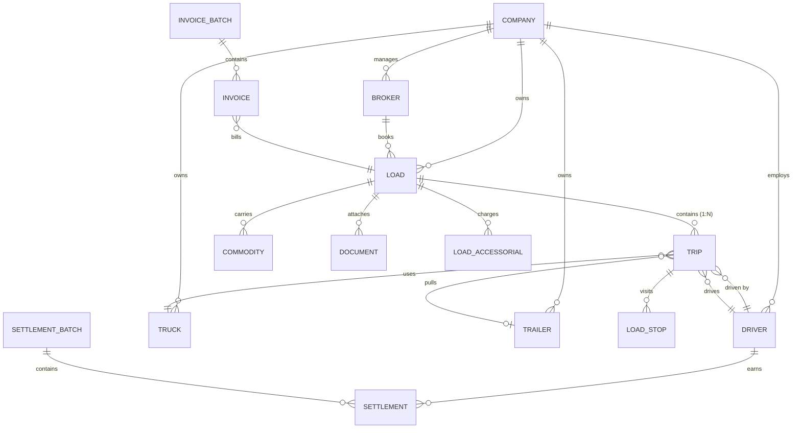
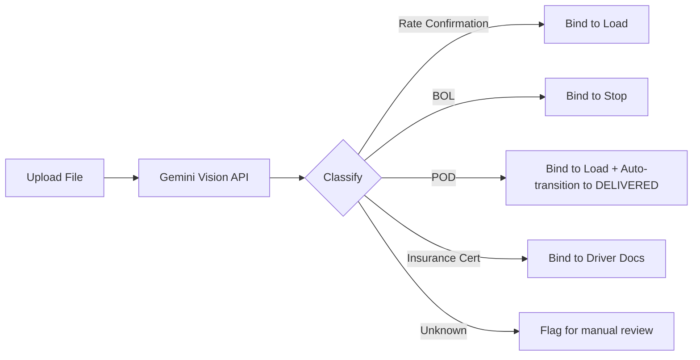

# 🏗️ Safehaul TMS — Master Implementation Blueprint
## The Definitive Engineering Source of Truth

> [!IMPORTANT]
> This document synthesizes the **Datatruck UI/UX Teardown** and the **Datatruck Functional Logic Audit** into a single, unified implementation specification. It is cross-referenced against the existing Safehaul codebase (`backend/app/models/`, `frontend/components/`) to identify gaps and required changes.

---

# Phase 1: Database Foundation & Data Architecture ✅ DONE

## 1.1 Critical Schema Gap: The `trips` Table

The single most important architectural finding from the audit is that **Datatruck decouples Drivers/Trucks from Loads via a `Trip` intermediary entity**. Our current schema has `driver_id`, `truck_id`, and `trailer_id` directly on the `loads` table — this is architecturally wrong and must be corrected.

**Why this matters:**
- A single Load can have **N Trips** (split loads, multi-leg routes)
- Driver/Truck are assigned to a **Trip**, not a Load
- Settlement math calculates at the **Trip** level, not the Load level
- The Trip entity has its own lifecycle (`assigned → dispatched → in_transit → delivered`)

### Current Schema (WRONG)
```
Load → driver_id FK (direct)
Load → truck_id FK (direct)
Load → trailer_id FK (direct)
```

### Target Schema (CORRECT)
```
Load → Trip(s) → driver_id FK
                → truck_id FK
                → trailer_id FK
```

## 1.2 Complete Enum Definitions

### Load Status Enum — 8-Stage Pipeline

The current `LoadStatus` enum has incorrect values. It must be corrected to match the 8-stage lifecycle:

```python
# CURRENT (WRONG — in backend/app/models/load.py)
class LoadStatus(str, enum.Enum):
    planned = "planned"       # ← should be "offer"
    dispatched = "dispatched"
    at_pickup = "at_pickup"   # ← does not exist in Datatruck
    in_transit = "in_transit"
    delivered = "delivered"
    delayed = "delayed"       # ← does not exist as a primary status
    billed = "billed"         # ← should be "invoiced"
    paid = "paid"
    cancelled = "cancelled"

# TARGET (CORRECT — 8-stage state machine)
class LoadStatus(str, enum.Enum):
    """8-stage load lifecycle. Transitions enforced in service layer."""
    offer = "offer"             # Stage 1: Draft load, all fields editable
    booked = "booked"           # Stage 2: Rate confirmation locked
    assigned = "assigned"       # Stage 3: Trip entity created, driver/truck linked
    dispatched = "dispatched"   # Stage 4: Driver notified, driver → ON_TRIP
    in_transit = "in_transit"   # Stage 5: En route, ETA tracking active
    delivered = "delivered"     # Stage 6: POD uploaded, load data lockable
    invoiced = "invoiced"       # Stage 7: Invoice batch created
    paid = "paid"               # Stage 8: Terminal state
    cancelled = "cancelled"     # Soft-delete escape hatch
```

### Trip Status Enum (NEW)

```python
class TripStatus(str, enum.Enum):
    """Trip lifecycle — subset of Load lifecycle."""
    assigned = "assigned"
    dispatched = "dispatched"
    in_transit = "in_transit"
    delivered = "delivered"
```

### Settlement Batch Status Enum

Current `SettlementStatus` uses `draft/ready/paid`. Must be corrected:

```python
# CURRENT (WRONG)
class SettlementStatus(str, enum.Enum):
    draft = "draft"
    ready = "ready"
    paid = "paid"

# TARGET (CORRECT — matches batch lifecycle)
class SettlementBatchStatus(str, enum.Enum):
    unposted = "unposted"   # Line items editable
    posted = "posted"        # Line items frozen, reversible via "Undo"
    paid = "paid"            # Terminal state, full lock
```

### Invoice Batch Status Enum (NEW)

```python
class InvoiceBatchStatus(str, enum.Enum):
    unposted = "unposted"
    partial_posted = "partial_posted"
    posted = "posted"
    paid = "paid"
```

### Driver Status Enum

Current enum is close but needs a coupling rename:

```python
# TARGET
class DriverStatus(str, enum.Enum):
    available = "available"     # Can be assigned to loads
    on_trip = "on_trip"         # Auto-set when Load → DISPATCHED
    inactive = "inactive"       # Manual toggle, hidden from assignable pool
    on_leave = "on_leave"       # Vacation board
    terminated = "terminated"   # Soft-terminated
```

## 1.3 New & Modified Tables

### NEW: `trips` Table

```python
class Trip(Base, TenantMixin):
    """Trip entity — the bridge between Load and Driver/Truck.
    A Load can have N Trips (multi-leg, split loads).
    Settlement math operates at the Trip level."""

    __tablename__ = "trips"
    __table_args__ = (
        UniqueConstraint('company_id', 'trip_number', name='uq_trips_company_number'),
    )

    trip_number: Mapped[str] = mapped_column(
        String(20), nullable=False  # 'TR-000001-01'
    )
    load_id: Mapped[uuid.UUID] = mapped_column(
        UUID(as_uuid=True), ForeignKey("loads.id", ondelete="CASCADE"), nullable=False
    )
    driver_id: Mapped[uuid.UUID | None] = mapped_column(
        UUID(as_uuid=True), ForeignKey("drivers.id", ondelete="RESTRICT"), nullable=True
    )
    truck_id: Mapped[uuid.UUID | None] = mapped_column(
        UUID(as_uuid=True), ForeignKey("trucks.id", ondelete="RESTRICT"), nullable=True
    )
    trailer_id: Mapped[uuid.UUID | None] = mapped_column(
        UUID(as_uuid=True), ForeignKey("trailers.id", ondelete="RESTRICT"), nullable=True
    )
    status: Mapped[TripStatus] = mapped_column(
        Enum(TripStatus, name="trip_status_enum", create_constraint=True),
        default=TripStatus.assigned, server_default="assigned"
    )
    sequence_number: Mapped[int] = mapped_column(Integer, default=1)
    driver_gross: Mapped[Decimal] = mapped_column(Numeric(12, 2), default=0)
    loaded_miles: Mapped[Decimal] = mapped_column(Numeric(10, 2), default=0)
    empty_miles: Mapped[Decimal] = mapped_column(Numeric(10, 2), default=0)

    # Relationships
    load = relationship("Load", back_populates="trips")
    driver = relationship("Driver", back_populates="trips")
    truck = relationship("Truck", back_populates="trips")
    trailer = relationship("Trailer", back_populates="trips")
    stops = relationship("LoadStop", back_populates="trip", cascade="all, delete-orphan")
```

### MODIFIED: `loads` Table

Remove `driver_id`, `truck_id`, `trailer_id` FKs. Add `trips` relationship:

```python
class Load(Base, TenantMixin):
    __tablename__ = "loads"

    # REMOVE: driver_id, truck_id, trailer_id (moved to Trip)
    # ADD:
    shipment_id: Mapped[str] = mapped_column(String(20), unique=True, nullable=False)
    is_locked: Mapped[bool] = mapped_column(Boolean, default=False, server_default="false")
    commission_dispatcher_id: Mapped[uuid.UUID | None] = mapped_column(
        UUID(as_uuid=True), ForeignKey("users.id"), nullable=True
    )

    # Relationships
    trips = relationship("Trip", back_populates="load", cascade="all, delete-orphan")
    commodities = relationship("Commodity", back_populates="load", cascade="all, delete-orphan")
```

### MODIFIED: `load_stops` → Reparented to Trip

```python
class LoadStop(Base, TenantMixin):
    __tablename__ = "load_stops"

    # CHANGE: load_id → trip_id
    trip_id: Mapped[uuid.UUID] = mapped_column(
        UUID(as_uuid=True), ForeignKey("trips.id", ondelete="CASCADE"), nullable=False
    )
    # ... rest unchanged
```

### NEW: `commodities` Table

```python
class Commodity(Base, TenantMixin):
    __tablename__ = "commodities"

    load_id: Mapped[uuid.UUID] = mapped_column(
        UUID(as_uuid=True), ForeignKey("loads.id", ondelete="CASCADE"), nullable=False
    )
    description: Mapped[str] = mapped_column(String(255), default="General freight")
    quantity: Mapped[int] = mapped_column(Integer, default=1)
    package_type: Mapped[str] = mapped_column(String(50), default="Skid")  # Skid|Pallet|Box
    pieces: Mapped[str] = mapped_column(String(20), default="PCS")
    total_weight: Mapped[Decimal | None] = mapped_column(Numeric(10, 2), nullable=True)
    weight_unit: Mapped[str] = mapped_column(String(5), default="lb")
    width: Mapped[Decimal | None] = mapped_column(Numeric(8, 2), nullable=True)
    height: Mapped[Decimal | None] = mapped_column(Numeric(8, 2), nullable=True)
    length: Mapped[Decimal | None] = mapped_column(Numeric(8, 2), nullable=True)
    note: Mapped[str | None] = mapped_column(Text, nullable=True)

    load = relationship("Load", back_populates="commodities")
```

### NEW: `invoice_batches` & `invoices` Tables

```python
class InvoiceBatch(Base, TenantMixin):
    __tablename__ = "invoice_batches"
    batch_id: Mapped[str] = mapped_column(String(20), unique=True, nullable=False)
    status: Mapped[InvoiceBatchStatus] = mapped_column(
        Enum(InvoiceBatchStatus, name="invoice_batch_status_enum"),
        default=InvoiceBatchStatus.unposted
    )
    total_amount: Mapped[Decimal] = mapped_column(Numeric(12, 2), default=0)
    invoice_count: Mapped[int] = mapped_column(Integer, default=0)
    created_by_id: Mapped[uuid.UUID | None] = mapped_column(
        UUID(as_uuid=True), ForeignKey("users.id"), nullable=True
    )
    invoices = relationship("Invoice", back_populates="batch", cascade="all, delete-orphan")

class Invoice(Base, TenantMixin):
    __tablename__ = "invoices"
    invoice_number: Mapped[str] = mapped_column(String(20), unique=True, nullable=False)
    batch_id: Mapped[uuid.UUID] = mapped_column(
        UUID(as_uuid=True), ForeignKey("invoice_batches.id"), nullable=False
    )
    load_id: Mapped[uuid.UUID] = mapped_column(
        UUID(as_uuid=True), ForeignKey("loads.id"), nullable=False
    )
    customer_id: Mapped[uuid.UUID] = mapped_column(
        UUID(as_uuid=True), ForeignKey("brokers.id"), nullable=False
    )
    amount: Mapped[Decimal] = mapped_column(Numeric(12, 2), nullable=False)
    billing_type: Mapped[str] = mapped_column(String(50), default="standard")
    batch = relationship("InvoiceBatch", back_populates="invoices")
```

## 1.4 Complete ER Diagram



---

# Phase 2: Core State Machines & Backend API Services ✅ DONE

## 2.1 Load Lifecycle State Machine

### Valid Transitions Map

```python
LOAD_TRANSITIONS: dict[LoadStatus, list[LoadStatus]] = {
    LoadStatus.offer:       [LoadStatus.booked, LoadStatus.cancelled],
    LoadStatus.booked:      [LoadStatus.assigned, LoadStatus.cancelled],
    LoadStatus.assigned:    [LoadStatus.dispatched, LoadStatus.booked, LoadStatus.cancelled],
    LoadStatus.dispatched:  [LoadStatus.in_transit, LoadStatus.assigned],
    LoadStatus.in_transit:  [LoadStatus.delivered],
    LoadStatus.delivered:   [LoadStatus.invoiced],
    LoadStatus.invoiced:    [LoadStatus.paid],
    LoadStatus.paid:        [],  # Terminal
    LoadStatus.cancelled:   [],  # Terminal
}
```

### Side-Effects per Transition

```python
TRANSITION_SIDE_EFFECTS = {
    ("booked", "assigned"): [
        "create_trip_entity",          # Trip TR-{ShipmentID}-{seq} created
        "link_driver_truck_to_trip",
    ],
    ("assigned", "dispatched"): [
        "validate_driver_compliance",   # CDL, Medical Card expiry check
        "validate_truck_availability",  # Truck must be AVAILABLE
        "set_driver_status_on_trip",    # Driver → ON_TRIP
        "set_truck_status_in_use",      # Truck → IN_USE
    ],
    ("in_transit", "delivered"): [
        "require_pod_document",         # POD must be uploaded
        "release_driver_status",        # Driver → AVAILABLE
        "release_truck_status",         # Truck → AVAILABLE
        "queue_auto_settlement",        # Trip earnings → next open batch
    ],
    ("delivered", "invoiced"): [
        "create_invoice_record",
        "lock_load_financial_fields",   # is_locked = True
    ],
}
```

### FastAPI Endpoint: Status Transition

```python
@router.patch("/api/v1/loads/{load_id}/status")
async def advance_load_status(
    load_id: UUID,
    body: StatusTransitionRequest,  # { "target_status": "dispatched" }
    db: AsyncSession = Depends(get_db),
    current_user: User = Depends(get_current_user),
):
    load = await load_service.get_load(db, load_id, current_user.company_id)
    current = LoadStatus(load.status)
    target = LoadStatus(body.target_status)

    # 1. Validate transition is allowed
    if target not in LOAD_TRANSITIONS[current]:
        raise HTTPException(400, f"Cannot transition from {current} to {target}")

    # 2. Execute side-effects
    side_effect_key = (current.value, target.value)
    if side_effect_key in TRANSITION_SIDE_EFFECTS:
        for effect in TRANSITION_SIDE_EFFECTS[side_effect_key]:
            await execute_side_effect(effect, load, db)

    # 3. Update status
    load.status = target
    await db.commit()
    return {"status": target.value}
```

## 2.2 Dispatch Workflow Endpoint

```python
@router.post("/api/v1/loads/{load_id}/dispatch")
async def dispatch_load(
    load_id: UUID,
    body: DispatchRequest,  # { driver_id, truck_id, trailer_id? }
    db: AsyncSession = Depends(get_db),
):
    load = await load_service.get_load(db, load_id)

    # 1. Compliance guardrails
    driver = await driver_service.get_driver(db, body.driver_id)
    compliance_issues = check_driver_compliance(driver)
    if compliance_issues and company.enforce_compliance:
        raise HTTPException(422, detail={"compliance_violations": compliance_issues})

    # 2. Availability check
    if driver.status != DriverStatus.available:
        raise HTTPException(409, "Driver is not available for dispatch")
    truck = await fleet_service.get_truck(db, body.truck_id)
    if truck.status != EquipmentStatus.available:
        raise HTTPException(409, "Truck is not available")

    # 3. Create Trip entity
    trip = Trip(
        trip_number=f"TR-{load.shipment_id.split('-')[1]}-{seq:02d}",
        load_id=load.id, driver_id=driver.id,
        truck_id=truck.id, trailer_id=body.trailer_id,
        company_id=load.company_id,
    )
    db.add(trip)

    # 4. Cascade status updates
    load.status = LoadStatus.dispatched
    driver.status = DriverStatus.on_trip
    truck.status = EquipmentStatus.in_use
    await db.commit()
```

## 2.3 Auto-Settlement Math Engine

```python
async def calculate_settlement(driver: Driver, trips: list[Trip]) -> SettlementResult:
    """Core settlement calculation — operates at Trip granularity."""
    total_earning = Decimal("0.00")

    for trip in trips:
        load = trip.load
        if driver.pay_rate_type == PayRateType.percentage:
            # Owner Operator: % of Load Gross
            trip_earning = load.total_rate * driver.pay_rate_value
        elif driver.pay_rate_type == PayRateType.cpm:
            # Company Driver: Cents Per Mile
            trip_earning = trip.loaded_miles * driver.pay_rate_value
        elif driver.pay_rate_type == PayRateType.fixed_per_load:
            trip_earning = driver.pay_rate_value
        else:
            trip_earning = Decimal("0.00")

        total_earning += trip_earning

    # Apply weekly deductions from CompanyDefaultDeduction
    deductions = await get_driver_deductions(driver)
    total_deductions = sum(d.amount for d in deductions)

    # Apply bonuses from "Weekly Other Pay"
    bonuses = await get_driver_bonuses(driver)
    total_bonus = sum(b.amount for b in bonuses)

    net_pay = total_earning + total_bonus - total_deductions
    driver_gross = sum(t.load.total_rate for t in trips)

    return SettlementResult(
        earning=total_earning,
        deductions=total_deductions,
        bonus=total_bonus,
        net_pay=net_pay,
        driver_gross=driver_gross,
        trip_count=len(trips),
    )
```

## 2.4 Compliance Guardrails

```python
def check_driver_compliance(driver: Driver) -> list[ComplianceViolation]:
    """Returns list of compliance issues. Empty = driver is 'Ready to go'."""
    violations = []
    today = date.today()

    if driver.cdl_expiry_date and driver.cdl_expiry_date < today:
        violations.append(ComplianceViolation(
            field="cdl", severity="critical",
            message=f"CDL expired {(today - driver.cdl_expiry_date).days} days ago"
        ))
    elif driver.cdl_expiry_date and (driver.cdl_expiry_date - today).days <= 30:
        violations.append(ComplianceViolation(
            field="cdl", severity="warning",
            message=f"CDL expires in {(driver.cdl_expiry_date - today).days} days"
        ))

    if driver.medical_card_expiry_date and driver.medical_card_expiry_date < today:
        violations.append(ComplianceViolation(
            field="medical_card", severity="critical",
            message=f"Medical card expired {(today - driver.medical_card_expiry_date).days} days ago"
        ))

    # No CDL on file
    if not driver.cdl_number:
        violations.append(ComplianceViolation(
            field="cdl", severity="critical",
            message="No CDL number on file"
        ))

    return violations
```

## 2.5 Complete API Endpoint Map

| # | Method | Endpoint | Purpose |
|---|--------|----------|---------|
| 1 | `POST` | `/api/v1/loads` | Create load (status=offer) |
| 2 | `PATCH` | `/api/v1/loads/:id/status` | Advance load status (state machine) |
| 3 | `POST` | `/api/v1/loads/:id/dispatch` | Create Trip, assign Driver/Truck |
| 4 | `POST` | `/api/v1/loads/:id/trips` | Add additional Trip (split load) |
| 5 | `GET` | `/api/v1/loads/:id/profit` | Calculate profit box data |
| 6 | `POST` | `/api/v1/settlement-batches` | Create salary batch |
| 7 | `PATCH` | `/api/v1/settlement-batches/:id/post` | Post batch (lock settlements) |
| 8 | `PATCH` | `/api/v1/settlement-batches/:id/undo` | Undo post (unlock) |
| 9 | `GET` | `/api/v1/settlements/calculate` | Preview settlement math |
| 10 | `POST` | `/api/v1/invoice-batches` | Create invoice batch |
| 11 | `GET` | `/api/v1/drivers/:id/compliance` | Get compliance status + violations |

---

# Phase 3: Global UI Architecture & Design System ✅ DONE

## 3.1 CSS Token Additions

The current `globals.css` has a solid foundation. Add these domain-specific tokens:

```css
:root {
  /* ── Logistics Status Colors (Warm Palette) ──────────────── */
  --status-offer: #FF5722;          /* Deep orange */
  --status-booked: #7C4DFF;         /* Deep purple */
  --status-assigned: #26A69A;       /* Teal */
  --status-dispatched: #1E88E5;     /* Blue */
  --status-in-transit: #FF9800;     /* Orange */
  --status-delivered: #43A047;      /* Green */

  /* ── Financial Status Colors (Cool Palette) ──────────────── */
  --status-unposted: #FF9800;       /* Amber */
  --status-posted: #5C6BC0;         /* Indigo */
  --status-partial-posted: #78909C; /* Blue-gray */
  --status-invoiced: #E91E63;       /* Pink */
  --status-paid: #43A047;           /* Green */

  /* ── Compliance Colors (Semantic) ────────────────────────── */
  --compliance-good: #43A047;
  --compliance-upcoming: #FFC107;
  --compliance-critical: #F44336;
  --compliance-expired: #B71C1C;

  /* ── Canvas and Card (existing, verify these match) ──────── */
  --canvas-bg: var(--surface);
  --card-bg: var(--surface-lowest);
  --card-border: var(--outline-variant);
  --card-radius: var(--radius-xl);
  --card-padding: 20px;

  /* ── Sidebar ─────────────────────────────────────────────── */
  --sidebar-width: 230px;
  --sidebar-collapsed-width: 64px;
  --sidebar-bg: var(--surface-lowest);
  --sidebar-active-bg: rgba(79, 70, 229, 0.08);
  --sidebar-active-text: var(--primary);
  --sidebar-hover-bg: var(--surface-container);

  /* ── TopBar ──────────────────────────────────────────────── */
  --topbar-height: 52px;
}
```

## 3.2 StatusBadge Component — Dual-Domain System

> [!WARNING]
> The current `StatusPill.tsx` uses hardcoded hex colors and does not distinguish between logistics and financial domains. This causes the exact same color collision that Datatruck suffers from.

```tsx
// components/ui/StatusBadge.tsx — REPLACEMENT for StatusPill.tsx
type BadgeVariant = 'solid' | 'outline';
type BadgeDomain = 'logistics' | 'financial' | 'compliance';

type LogisticsIntent = 'offer' | 'booked' | 'assigned' | 'dispatched' | 'inTransit' | 'delivered';
type FinancialIntent = 'unposted' | 'posted' | 'partialPosted' | 'invoiced' | 'paid';
type ComplianceIntent = 'good' | 'upcoming' | 'critical' | 'expired';

type BadgeIntent = LogisticsIntent | FinancialIntent | ComplianceIntent;

interface StatusBadgeProps {
  intent: BadgeIntent;
  variant?: BadgeVariant;
  domain?: BadgeDomain;
  size?: 'sm' | 'md';
  children: React.ReactNode;
}

const INTENT_TO_CSS_VAR: Record<BadgeIntent, string> = {
  // Logistics
  offer: '--status-offer',
  booked: '--status-booked',
  assigned: '--status-assigned',
  dispatched: '--status-dispatched',
  inTransit: '--status-in-transit',
  delivered: '--status-delivered',
  // Financial
  unposted: '--status-unposted',
  posted: '--status-posted',
  partialPosted: '--status-partial-posted',
  invoiced: '--status-invoiced',
  paid: '--status-paid',
  // Compliance
  good: '--compliance-good',
  upcoming: '--compliance-upcoming',
  critical: '--compliance-critical',
  expired: '--compliance-expired',
};
```

## 3.3 Sidebar Navigation Structure

```
📊 Dashboard
📨 Mailbox                          [NEW]
📦 Load Management ▾
   ├── All Loads
   ├── Live Loads
   ├── My Loads
   ├── LTL Trips
   └── 🔗 Loadboard                 [NEW]
💰 Accounting ▾
   ├── Invoices
   ├── Salary
   └── Bills
👥 Customer Management ▾
   ├── Customers (Brokers)
   ├── Vendors
   └── Locations
🚛 Fleet Management ▾
   ├── Trucks
   ├── Trailers
   └── Inspections
👤 HR Management ▾
   ├── Drivers
   └── Users
🛡️ Safety
🔧 Maintenance
📊 Reports
🏪 Apps & Marketplace               [NEW]
─────────────────────────────────────────
🏢 COMPANY NAME
👤 User Name (email@company.com)
⚙️ Settings
```

**Sidebar Interaction Rules:**
- Single-expand accordion (only 1 section open at a time)
- Active parent: text turns `var(--primary)`, background `var(--sidebar-active-bg)`
- Active child: left border accent strip (2px solid primary)
- Hover: background `var(--sidebar-hover-bg)`

**"NEW" Feature Badge:**
Items with `[NEW]` annotations render a bright blue pill badge to draw attention to newly launched features. This badge should auto-expire after a configurable period (default: 30 days post-launch).

```tsx
// components/ui/NewBadge.tsx
interface NewBadgeProps {
  label?: string; // default: "NEW"
}

function NewBadge({ label = "NEW" }: NewBadgeProps) {
  return (
    <span
      className="inline-flex items-center px-2 py-0.5 rounded-full
                 text-[10px] font-bold tracking-wide uppercase
                 ml-auto shrink-0"
      style={{
        backgroundColor: 'var(--status-dispatched)', // #1E88E5
        color: 'white',
      }}
    >
      {label}
    </span>
  );
}
```

**Sidebar Footer:** The bottom of the sidebar contains the tenant company name, current user identity (name + email), and a settings gear icon. This section is always visible and does not scroll with the navigation items.

## 3.4 Breadcrumb System

```tsx
// Pattern: Module / Sub-page / Entity ID [StatusBadge]
interface BreadcrumbItem {
  label: string;
  href?: string;  // Last item has no href (current page)
}
// Max depth: 5 levels (e.g., Accounting / Salary / Batches / SB-000100 / ST-002371)
```

## 3.5 TopBar & Global Search (Ctrl+K)

The TopBar is a persistent `52px` tall bar fixed to the viewport top. It spans the full width minus the sidebar.

**TopBar Layout (left → right):**

| Element | Details |
|---------|---------|
| **Logo** | Safehaul wordmark, left-aligned |
| **Breadcrumbs** | Dynamic path segments (see §3.4) |
| **Category Filter** | Dropdown scoping search to: `All`, `Loads`, `Drivers`, `Trucks`, `Invoices` |
| **Global Search** | Input with placeholder `Ctrl + K to search` and magnifying glass icon |
| **Quick Create** | `+ Create new` button — always visible regardless of current module |
| **Notifications** | Bell 🔔 icon with unread count badge |
| **User Menu** | Avatar + dropdown (Profile, Settings, Sign out) |

**Global Search (`CommandMenu`) Component:**

This is a power-user feature essential for dispatcher speed. It must be implemented as a full-screen command palette overlay (similar to VS Code / Spotlight).

```tsx
// components/layout/CommandMenu.tsx
interface CommandMenuProps {
  isOpen: boolean;
  onClose: () => void;
}

// Keyboard shortcut registration (in root layout):
useEffect(() => {
  const handler = (e: KeyboardEvent) => {
    if ((e.metaKey || e.ctrlKey) && e.key === 'k') {
      e.preventDefault();
      setCommandMenuOpen(true);
    }
  };
  document.addEventListener('keydown', handler);
  return () => document.removeEventListener('keydown', handler);
}, []);
```

**Search Result Types:**

| Category | Result Format | Action |
|----------|--------------|--------|
| Loads | `SH-000123 — Broker Name — $4,500` | Navigate to load detail |
| Drivers | `John Doe — CDL: A — Available` | Navigate to driver profile |
| Trucks | `TRK-402 — 2024 Freightliner — Available` | Navigate to truck detail |
| Invoices | `IB-000095 — $12,500 — Unposted` | Navigate to invoice batch |

**"+ Create New" Quick Action:**
The `+ Create new` button in the TopBar is always accessible regardless of which module the user is in. Clicking it opens a dropdown with options: `New Load`, `New Driver`, `New Truck`. This is critical for dispatcher workflow speed — they should never need to navigate away from their current context to create a new entity.

---

# Phase 4: Component Engineering — The DataTable ✅ DONE

## 4.1 Enhanced DataTable Props

The current `DataTable.tsx` is a good start but lacks critical features from the audit. Here is the target interface:

```tsx
interface DataTableProps<T> {
  // Data
  data: T[];
  columns: ColumnDef<T>[];
  isLoading?: boolean;

  // Tab-Based Segmentation (CRITICAL — every list page needs this)
  tabs?: Array<{
    label: string;
    key: string;
    count?: number;
    isActive: boolean;
  }>;
  onTabChange?: (tabKey: string) => void;

  // Filtering
  filterConfig?: FilterConfig[];
  quickDateFilters?: { pickup?: boolean; delivery?: boolean };
  statusFilter?: { options: string[]; current: string };

  // Selection & Bulk Actions
  selectable?: boolean;
  selectedIds?: string[];
  onSelectionChange?: (ids: string[]) => void;
  bulkActions?: Array<{
    label: string;
    icon?: React.ReactNode;
    onClick: (selectedIds: string[]) => void;
    variant?: 'default' | 'danger';
  }>;

  // Sticky Aggregate Footer (CRITICAL)
  stickyFooter?: Array<{
    label: string;
    value: string;
    format?: 'currency' | 'number' | 'miles' | 'percentage';
  }>;

  // Empty State (CRITICAL — Safehaul differentiator)
  emptyState?: {
    icon: React.ReactNode;
    title: string;
    description: string;
    ctaLabel: string;
    ctaHref: string;
    learnMoreHref?: string;
  };

  // Display
  density?: 'compact' | 'comfortable';
  zebraStripe?: boolean;
  columnToggle?: boolean;
  exportable?: boolean;
  savedViews?: boolean;

  // Row Interactions
  onRowClick?: (row: T) => void;
  expandableRow?: (row: T) => React.ReactNode;
  rowActions?: Array<{
    label: string;
    icon?: React.ReactNode;
    onClick: (row: T) => void;
    destructive?: boolean;
  }>;

  // Pagination
  pageSize?: number;
  pageSizeOptions?: number[];
  totalCount?: number;
  currentPage?: number;
  onPageChange?: (page: number) => void;
}
```

## 4.2 Sticky Aggregate Footer

```tsx
{stickyFooter && (
  <div className="sticky bottom-0 z-10 px-4 py-3 flex flex-wrap gap-x-6 gap-y-1
                   text-xs font-semibold border-t"
       style={{
         backgroundColor: 'var(--surface-low)',
         borderColor: 'var(--outline-variant)',
         color: 'var(--on-surface)',
       }}>
    {stickyFooter.map((agg, i) => (
      <span key={i} className="tabular-nums">
        <span style={{ color: 'var(--on-surface-variant)' }}>{agg.label}: </span>
        {agg.value}
      </span>
    ))}
  </div>
)}
```

## 4.3 EntityLink Component (Inline Copy Pattern)

```tsx
interface EntityLinkProps {
  href: string;
  label: string;
  copyable?: boolean;     // Shows 📋 icon, copies value on click
  inlineEdit?: boolean;   // Shows ✏️ icon on hover
  secondaryText?: string; // Subtext like "CDL exp. 4/9/2028"
}

// Usage in table cell:
// <EntityLink href="/loads/DT-005835" label="DT-005835" copyable />
```

---

# Phase 5: Complex Workflows — The 70/30 Layout ✅ DONE

## 5.1 Load Detail Page Architecture

```tsx
// app/(dashboard)/loads/[id]/page.tsx
export default function LoadDetailPage() {
  const [isEditing, setIsEditing] = useState(false);

  return (
    <>
      {/* Sticky Header with Status Stepper */}
      <PageHeader
        breadcrumbs={[
          { label: "Load Management", href: "/loads" },
          { label: `SH-${loadId}` },
        ]}
        statusBadge={{ intent: "dispatched", label: "Dispatched" }}
        primaryAction={{
          label: getNextActionLabel(load.status), // "Mark as In-Transit"
          onClick: () => advanceStatus(load.status),
        }}
        secondaryActions={[
          { label: "Follow load", icon: <UserPlus />, onClick: followLoad },
          { label: "Share", icon: <ExternalLink />, onClick: shareLoad },
          { label: "Set ETA", onClick: openETAModal },
        ]}
        // Toggle between "Edit load" and "Save load" in header
        editAction={isEditing
          ? { label: "Save load", icon: <Save />, onClick: () => saveAndExitEdit() }
          : { label: "Edit load", icon: <Pencil />, onClick: () => setIsEditing(true) }
        }
        kebabActions={[
          { label: "Duplicate load", onClick: duplicateLoad },
          { label: "Add flag to load", onClick: flagLoad },
          { label: "Cancel load", onClick: cancelLoad, destructive: true },
          { label: "Move to Archive", onClick: archiveLoad },
        ]}
      />

      <StatusStepper
        stages={LOAD_STAGES}
        currentStage={load.status}
      />

      {/* 70/30 Split */}
      <div className="grid grid-cols-[1fr_380px] gap-6 px-6 py-4">
        {/* LEFT 70% — Tabbed Content */}
        <main>
          <Tabs defaultValue="load-info">
            <TabsList>
              <TabsTrigger value="load-info">Load Info</TabsTrigger>
              <TabsTrigger value="trips">Trips ({trips.length})</TabsTrigger>
              <TabsTrigger value="commodities">Commodities</TabsTrigger>
              <TabsTrigger value="documents">Documents</TabsTrigger>
              <TabsTrigger value="tasks">Tasks</TabsTrigger>
              <TabsTrigger value="mileage">Mileage by State</TabsTrigger>
              <TabsTrigger value="financials">Financials</TabsTrigger>
              <TabsTrigger value="status-updates">Status Updates</TabsTrigger>
            </TabsList>
            {/* Tab content panels — rendered in read or edit mode */}
            <TabsContent value="load-info">
              <LoadInfoCards load={load} isEditing={isEditing} />
            </TabsContent>
            {/* ... other tab panels */}
          </Tabs>
        </main>

        {/* RIGHT 30% — Sticky Sidebar */}
        <aside className="sticky top-20 h-fit space-y-4">
          <ActivityPanel loadId={loadId} />
          <ProfitBox loadId={loadId} />
        </aside>
      </div>
    </>
  );
}
```

### 5.1.1 In-Place Read/Edit Toggle Paradigm

The Load detail page uses an **in-place editing** pattern — clicking "Edit load" in the header transforms read-only card content into editable form fields without any page navigation or modal. This is critical because it preserves the user's spatial context.

**View Mode → Edit Mode Transformation:**

| View Mode (Read-Only) | Edit Mode (Editable) |
|----------------------|---------------------|
| `MC Number: WENZE TRANSPORT` (plain text) | `<RichAutocomplete>` dropdown with company search |
| `Customer: Aptar Inc.` (blue EntityLink) | `<RichAutocomplete>` with name + address + ID |
| `Load Pay: $3,600.00` (text + copy icon) | `<CurrencyInput>` with validation |
| `Transportation Mode: FTL` (text) | `<Select>` dropdown (FTL, LTL, Partial) |
| `Mileage Type: Google` (text) | `<Select>` dropdown (Google, PC*Miler, Manual) |
| Stop rows (read-only text) | Stop rows with inline inputs + drag handle (`⠿`) |

**Implementation Pattern:**

```tsx
// components/loads/LoadInfoCards.tsx
interface LoadInfoCardsProps {
  load: Load;
  isEditing: boolean;
}

function LoadInfoCards({ load, isEditing }: LoadInfoCardsProps) {
  return (
    <div className="space-y-4">
      {/* Each card section toggles between display and form */}
      <Card title="Load Info">
        <FieldRow label="MC Number">
          {isEditing ? (
            <RichAutocomplete
              value={load.mcNumber}
              onChange={updateField('mcNumber')}
              items={mcNumbers}
            />
          ) : (
            <span className="body-md">{load.mcNumber}</span>
          )}
        </FieldRow>
        <FieldRow label="Load ID">
          {isEditing ? (
            <Input value={load.brokerLoadId} onChange={updateField('brokerLoadId')} />
          ) : (
            <EntityLink label={load.brokerLoadId} copyable />
          )}
        </FieldRow>
        {/* ... more fields */}
      </Card>

      <Card title="Payment">
        <FieldRow label="Load Pay">
          {isEditing ? (
            <CurrencyInput value={load.totalPay} onChange={updateField('totalPay')} />
          ) : (
            <span className="body-md tabular-nums">
              ${load.totalPay.toLocaleString()}
              <CopyButton value={load.totalPay} />
            </span>
          )}
        </FieldRow>
      </Card>
    </div>
  );
}
```

**Header Action Toggle:**
- **View mode:** Header shows `✏️ Edit load` button (secondary) + `[Mark as In-Transit]` (primary blue)
- **Edit mode:** Header replaces `✏️ Edit load` with `💾 Save load` button. The primary action (`Mark as In-Transit`) remains visible.
- **Secondary save link:** A convenience "Save load" text link also appears inline below the Trips section for users who scroll past the header.

> [!IMPORTANT]
> The primary lifecycle CTA (e.g., "Mark as In-Transit") must ALWAYS remain visible in the header, even in edit mode. It should never scroll out of view. This is a non-negotiable UX requirement for dispatcher workflow speed.

## 5.2 Ghost Row Component

```tsx
interface GhostRowProps {
  columns: Array<{
    placeholder: string;   // "+ Add stop position"
    icon?: React.ReactNode; // 📍
    width?: string;
  }>;
  onActivate: () => void;
  isActive: boolean;
}

function GhostRow({ columns, onActivate, isActive }: GhostRowProps) {
  if (isActive) {
    // Render actual input fields in the same columnar layout
    return <InlineEditRow columns={columns} />;
  }

  return (
    <tr
      onClick={onActivate}
      className="cursor-pointer transition-colors group"
      style={{
        backgroundColor: 'var(--surface)',
        borderBottom: '1px dashed var(--outline-variant)',
      }}
    >
      {columns.map((col, i) => (
        <td key={i} className="px-4 py-3 text-xs"
            style={{ color: 'var(--outline)' }}>
          <span className="flex items-center gap-1.5 group-hover:text-[var(--primary)]">
            {col.icon}
            {col.placeholder}
          </span>
        </td>
      ))}
    </tr>
  );
}
```

**Usage in Stops, Commodities, and Deductions:**

```tsx
<GhostRow
  columns={[
    { placeholder: "+ Add stop position" },
    { placeholder: "Add company name" },
    { placeholder: "Add stop location", icon: <MapPin /> },
    { placeholder: "Add Zip" },
    { placeholder: "Appointment date" },
  ]}
  onActivate={() => appendStop()}
  isActive={isAddingStop}
/>
```

## 5.3 Profit Box Component

```tsx
interface ProfitBoxProps {
  loadId: string;
}

// Consumes: GET /api/v1/loads/:id/profit
interface ProfitData {
  totalMileRevenue: number;
  accessorials: number;
  driverEarnings: number;   // Displayed as negative (red, parenthesized)
  bills: number;            // Displayed as negative (red, parenthesized)
  grossProfit: number;
}

function ProfitBox({ loadId }: ProfitBoxProps) {
  const { data } = useSWR(`/api/v1/loads/${loadId}/profit`);
  return (
    <div className="card p-4 space-y-2">
      <h3 className="title-sm">Profit Summary</h3>
      <div className="space-y-1 text-sm tabular-nums">
        <Row label="Total mile revenue" value={data.totalMileRevenue} positive />
        <Row label="Accessorials" value={data.accessorials} positive />
        <Row label="Driver earnings" value={data.driverEarnings} negative />
        <Row label="Bills" value={data.bills} negative />
        <hr style={{ borderColor: 'var(--outline-variant)' }} />
        <Row label="Gross profit" value={data.grossProfit}
             className="font-bold text-base" />
      </div>
    </div>
  );
}
```

## 5.4 Driver Profile Page Architecture

The driver profile page uses a **full-page form layout** (NOT the 70/30 split used by loads). It features a **10-tab horizontal navigation** for organizing the extensive driver data.

### Tab Navigation

```tsx
// app/(dashboard)/drivers/[id]/page.tsx
const DRIVER_TABS = [
  { key: 'main',        label: 'Main' },
  { key: 'documents',   label: 'Documents' },
  { key: 'mobile',      label: 'Mobile App Login' },
  { key: 'recruiting',  label: 'Recruiting' },
  { key: 'accounting',  label: 'Accounting' },
  { key: 'safety',      label: 'Safety' },
  { key: 'assets',      label: 'Assets' },
  { key: 'statistics',  label: 'Statistics' },
  { key: 'log-history', label: 'Log History' },
  { key: 'tasks',       label: 'Tasks' },
  { key: 'others',      label: 'Others' },
] as const;
```

### Main Tab — 3-Column Layout

```tsx
<div className="grid grid-cols-3 gap-6">
  {/* Column 1 — Personal Information */}
  <div className="space-y-4">
    <PhotoUpload />
    <StarRating value={driver.rating} />
    <Toggle label="Local driver" />
    <Input label="First Name" required />
    <Input label="Middle Name" />
    <Input label="Last Name" required />
    <DatePicker label="Birth Date" />
    <PhoneInput label="Contact Number" />
    <PhoneInput label="Telegram Number" verified={driver.telegramVerified} />
    <Input label="SSN" masked />
    <Select label="Gender" options={['Male','Female','Other']} />
    <Select label="Marital Status" />
    <Select label="Employment Status" options={['Active','Inactive','Terminated']} />
    <Select label="Driver Status" options={['Available','On Trip','Inactive']} />
    <Input label="Email Address" type="email" />
    <DatePicker label="Hire Date" />
    <ReadOnly label="Tenure at Company" value={calculateTenure(driver.hireDate)} />
    {/* Compliance Section */}
    <SectionDivider label="Compliance" />
    <Input label="Driver License ID" />
    <Select label="DL Class" options={['A','B','C']} />
    <Select label="Driver Type" options={['Company driver','Owner operator']} />
  </div>

  {/* Column 2 — Assignments */}
  <div className="space-y-4">
    <RichAutocomplete label="Assigned Truck" entity="trucks" />
    <RichAutocomplete label="Assigned Trailer" entity="trailers" />
    <Input label="Other ID" />
    <RichAutocomplete label="MC Number" entity="companies" />
    <RichAutocomplete label="Safety Manager" entity="users" />
    <RichAutocomplete label="HR Manager" entity="users" />
    <TagInput label="Driver Tags" />
  </div>

  {/* Column 3 — Team & Payment */}
  <div className="space-y-4">
    <RadioGroup label="Team Driver" options={['Yes','No']} />
    <Checkbox label="Main driver" />
    <RichAutocomplete label="Co-Driver" entity="drivers" />
    <Select label="Payment Allocation" />
    <Input label="Percent Salary" type="number" suffix="%" />
    <RichAutocomplete label="Assigned Dispatcher" entity="users" />
    <Textarea label="Notes" />
    <SectionDivider label="Comments" />
    <CommentThread entityId={driver.id} entityType="driver" />
  </div>
</div>
```

### Documents Tab — File-Manager Compliance Table

The Documents tab uses a **file-manager-style table** with collapsible folder rows. Each document category is a top-level folder that expands to show individual uploaded files.

```tsx
// components/drivers/ComplianceDocTable.tsx
interface DocCategory {
  name: string;           // "CDL", "Medical Card", "MVR", etc.
  issueDate?: string;
  expiryDate?: string;
  uploadedDate?: string;
  status: 'approved' | 'pending' | 'missing' | 'expired';
  files: UploadedFile[];  // Expandable child rows
  required: boolean;      // Drives "Ready to go" / "Not ready" logic
}

const DOCUMENT_CATEGORIES: DocCategory[] = [
  { name: 'MVR',                     required: true },
  { name: 'Employment Verification', required: false },
  { name: 'CDL',                     required: true },
  { name: 'Clearing House',          required: true },
  { name: 'Drug Test',               required: true },
  { name: 'Medical Card',            required: true },
  { name: 'CCF',                     required: false },
  { name: 'SSN Card',                required: false },
  { name: 'Bank Account',            required: false },
  { name: 'Application',             required: false },
  { name: 'Other',                   required: false },
];
```

**Document Table Columns:**

| Column | Format |
|--------|--------|
| ▸ File Name | Folder icon 📁 + category name (expandable) |
| Issue Date | `Mon DD, YYYY` or `—` |
| Exp. Date | `Mon DD, YYYY` or `—` (highlighted if near expiry) |
| Uploaded Date | `Mon DD, YYYY` or `—` |
| Status | `Pending...` (orange text), `Approved` (green), `—` (missing) |
| Notes | Free text |

**Table Actions:**
```
[Download (N)] | [Bulk Upload] — right-aligned in table toolbar
```

**"Ready to go" Logic:**
A driver's `Assign status` is derived from their compliance documents:
- ✅ **"Ready to go"** — All `required: true` categories have non-expired, approved documents
- ⚠️ **"Not ready"** — Any `required: true` category is missing, expired, or still pending

### Accounting Tab — Payment Configuration

```tsx
<div className="space-y-6">
  {/* Payment Tariff */}
  <Card title="Payment Tariff">
    <Select
      label="Tariff Type"
      options={['88% Gross', '70 CPM', '67 CENT PER MILE', 'Custom']}
      value={driver.paymentTariff}
    />
    <Button variant="warning">Backtrack Calculation</Button>
  </Card>

  {/* Weekly Other Pay — uses Ghost Row pattern */}
  <Card title="Weekly Other Pay">
    <MiniTable
      columns={['Type', 'Note', 'Quantity', 'Amount', 'Total']}
      rows={driver.weeklyOtherPay}
    />
    <GhostRow
      columns={[
        { placeholder: '+ Add type' },
        { placeholder: 'Add note' },
        { placeholder: 'Qty' },
        { placeholder: 'Amount' },
        { placeholder: 'Total' },
      ]}
      onActivate={() => addOtherPay()}
    />
  </Card>

  {/* Weekly Deductions — same Ghost Row pattern */}
  <Card title="Weekly Deductions">
    <MiniTable
      columns={['Type', 'Note', 'Quantity', 'Amount', 'Total']}
      rows={driver.weeklyDeductions}
    />
    <GhostRow
      columns={[
        { placeholder: '+ Add type' },
        { placeholder: 'Add note' },
        { placeholder: 'Qty' },
        { placeholder: 'Amount' },
        { placeholder: 'Total' },
      ]}
      onActivate={() => addDeduction()}
    />
  </Card>
</div>
```

### Others Tab — Banking, Tax & ELD Configuration

| Section | Fields |
|---------|--------|
| **Default Configuration** | Restrictions dropdown, IFTA toggle, Rate confirmation visibility, Load Pay visibility |
| **ELD Operations** | Break/Drive/Shift/Cycle timers (circular gauge widgets) |
| **Billing Address** | Full address form (Street, City, State, ZIP) |
| **Pay To** | Pay To entity, EIN Number, Bank Name, Routing Number, Account Number |
| **Fuel Card** | Deduction options, Fuel discount toggle, Discount type |
| **Tax** | Employee (W2) vs Contractor (1099) radio, Filing Status, Allowances, Extra Withholding |

---

# Phase 6: Safehaul Differentiators ✅ DONE

## 6.1 Three-Tier Compliance Urgency System

**Datatruck Gap:** Shows a simple "Not ready" text label. No urgency indication, no timeline.

**Safehaul Implementation:**

| Tier | Condition | Visual | Action |
|------|-----------|--------|--------|
| 🟢 **GOOD** | All docs current, >30 days to expiry | Green badge | None |
| 🟡 **UPCOMING** | Any doc expiring within 30 days | Yellow badge + countdown | Auto-schedule reminder |
| 🔴 **CRITICAL** | Any doc expired OR expiring within 7 days | Red badge + pulsing dot | Block dispatch (if enforced), auto-notify safety manager |

**Driver List Column Addition:**

```tsx
{
  header: "Compliance",
  accessorKey: "compliance",
  cell: (driver) => {
    const { urgency, issues } = driver.complianceStatus;
    return (
      <div className="flex items-center gap-2">
        <ComplianceDot urgency={urgency} />
        <span className="text-xs">
          {urgency === 'good' ? 'All current' :
           `${issues[0].field} — ${issues[0].message}`}
        </span>
      </div>
    );
  }
}
```

## 6.2 AI Document Classification Pipeline

**Datatruck Gap:** Users manually tag uploaded files as BOL/POD/RC.

**Safehaul Implementation:**



**Backend Service:**

```python
@router.post("/api/v1/documents/classify")
async def classify_document(file: UploadFile):
    # 1. Upload to storage
    file_url = await storage.upload(file)

    # 2. Call Gemini Vision for classification
    classification = await gemini.classify_document(file_url)
    # Returns: { "type": "pod", "confidence": 0.94, "extracted_data": {...} }

    # 3. If POD with high confidence, auto-transition load
    if classification.type == "pod" and classification.confidence > 0.85:
        load = await load_service.get_load_by_context(classification.extracted_data)
        if load and load.status == LoadStatus.in_transit:
            await advance_load_status(load, LoadStatus.delivered)

    return classification
```

## 6.3 Custom Empty States

**Datatruck Gap:** Generic "No Rows To Show" text (AG Grid default).

**Safehaul Implementation:** Every empty table gets a custom illustration and CTA.

| Module | Icon | Title | Description | CTA |
|--------|------|-------|-------------|-----|
| Loads | 📦 Truck illustration | "No loads yet" | "Create your first load to start tracking shipments" | `+ Create Load` |
| Drivers | 👤 Person illustration | "No drivers on file" | "Add your first driver to start dispatching" | `+ Add Driver` |
| Fleet | 🚛 Truck illustration | "No trucks registered" | "Register your fleet to begin assignments" | `+ Add Truck` |
| Settlements | 💰 Calculator illustration | "No settlements yet" | "Settlements are created automatically when loads are delivered" | `View Delivered Loads →` |

## 6.4 Prioritized Differentiator Roadmap

| Priority | Feature | Engineering Effort | Business Impact |
|----------|---------|-------------------|-----------------|
| 🔥 P0 | **3-Tier Compliance Urgency** | 2 days | Prevents FMCSA violations |
| 🔥 P0 | **Custom Empty States** | 1 day | Critical for onboarding UX |
| 🔥 P0 | **Domain-Separated Status Colors** | 1 day | Eliminates visual confusion |
| ⚡ P1 | **Auto-Settlement Engine** | 3 days | Eliminates accounting lag |
| ⚡ P1 | **Configurable Hard Compliance Blocks** | 2 days | Enterprise safety feature |
| 💡 P2 | **AI Document Classification** | 4 days | Saves 5-10 min per load |
| 💡 P2 | **Dynamic Backhaul Suggestions** | 5 days | Maximizes RPM |
| 📋 P3 | **Fleet Maintenance Scheduling** | 5 days | Reduces breakdown risk |

---

# Appendix: Migration Checklist

## Database Migrations Required

1. Create `trips` table
2. Create `commodities` table
3. Create `invoice_batches` table
4. Create `invoices` table
5. Migrate `loads.driver_id`, `loads.truck_id`, `loads.trailer_id` → `trips` table
6. Reparent `load_stops.load_id` → `load_stops.trip_id`
7. Update `LoadStatus` enum values
8. Update `SettlementStatus` → `SettlementBatchStatus` enum values
9. Add `settlement_batch_id` FK to `driver_settlements`
10. Add `is_locked` column to `loads`

## Frontend Components to Build/Modify

| Component | Status | Priority |
|-----------|--------|----------|
| `StatusBadge` (replace StatusPill) | ✅ Done | P0 |
| `DataTable` (add tabs, footer, empty states) | ✅ Done | P0 |
| `EntityLink` | ✅ Done | P0 |
| `PageHeader` (with breadcrumbs + edit toggle) | ✅ Done | P0 |
| `ComplianceDot` | ✅ Done | P0 |
| `EmptyState` | ✅ Done | P0 |
| `NewBadge` (sidebar feature badges) | ✅ Done | P0 |
| `CommandMenu` (Ctrl+K global search) | ✅ Done | P0 |
| `GhostRow` | ✅ Done | P1 |
| `StatusStepper` | ✅ Done | P1 |
| `ProfitBox` | ✅ Done | P1 |
| `ActivityPanel` | ✅ Done | P1 |
| `RichAutocomplete` | 🟡 Future (P2) | P1 |
| `LoadInfoCards` (read/edit toggle) | ✅ Done (embedded in Load Detail) | P1 |
| `ComplianceDocTable` (driver file manager) | 🟡 Placeholder | P1 |

> [!IMPORTANT]
> This blueprint is the **single source of truth** for all Safehaul TMS engineering work. Every PR should reference the relevant phase and section number from this document.
